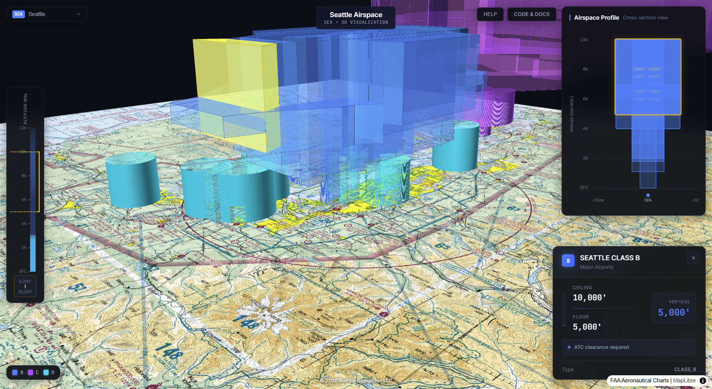

# 3D Airspace Visualizer

An interactive web-based 3D visualization of FAA airspace boundaries, rendering controlled airspace as volumetric "upside down wedding cake" structures. Explore Class B, C, D, and E airspace for 32 US terminal areas.



**Live Demo**: [airspace.llew.net](https://airspace.llew.net)

> **Note**: This repository reflects the initial development. The live demo at airspace.llew.net includes additional refinements. This is the code that built the initial version. It works. I'm not actively maintaining this repo.

## Why I Built This

Sectional charts have always fascinated me. They're incredibly dense with information, and the complex airspace around SeaTac is all right there if you know what you're looking at.

When I explain it to non-aviation friends, how Class B airspace stacks up like an upside-down wedding cake, why you need clearance here but not there, they're genuinely interested. But it always involves a lot of hand-waving and "imagine there's a shelf at 3,000 feet that extends out to here..." I've wished for years that I had a visual tool to just *show* them.

I bugged Steve Podradchik at Seattle Avionics a few times about adding something like this to FlyQ. I think he started to get annoyed with me about that. 😊

So I finally sat down with Claude Code and knocked out the initial version in a couple of hours. The [initial prompt](prompt.md) is in this repo if you're curious about the AI-assisted development process. It took another day to get it deployed on Azure and ready for some traffic.

I'd love to hear what you think: [llew@llew.net](mailto:llew@llew.net)

## Features

- **3D Volumetric Rendering**: Airspace displayed as extruded 3D volumes showing floor-to-ceiling altitude extent
- **32 Terminal Areas**: Seattle, Los Angeles, New York, Chicago, and more
- **Interactive Controls**: Pan, zoom, rotate, and tilt the view
- **Click to Select**: Tap any airspace volume to see detailed information
- **Altitude Profile**: Visual chart showing airspace stacking (desktop)
- **Mobile Optimized**: Simplified touch-friendly interface for phones and tablets
- **FAA Sectional Chart**: Real VFR sectional chart as the base map layer

## Browser Compatibility

This application requires WebGL 2.0 support for 3D rendering. Not tested on Android browsers.

**Supported Browsers**:
- Chrome 56+ (recommended)
- Firefox 51+ (renders slowly on Windows)
- Safari 15+
- Edge 79+

**Not Supported**:
- Internet Explorer
- Older mobile browsers without WebGL 2.0

For best performance, use a desktop browser with hardware acceleration enabled.

## Known Limitations

- **Altitude Accuracy**: Some Class E airspace floors shown as MSL may actually be AGL in the FAA data; terrain elevation is not factored in
- **Data Currency**: Airspace boundaries are static snapshots from the FAA; they may not reflect recent amendments
- **Mobile Performance**: Complex terminal areas with many airspace segments may render slowly on older mobile devices
- **Class E Coverage**: Class E airspace display is simplified; very large Class E areas are filtered for performance

## How It Was Created

This project was built entirely through AI-assisted development using **Claude Code** (Anthropic's CLI tool). The entire codebase, from initial scaffolding to production deployment, was generated through natural language conversation with Claude.

### The Process

1. **Initial Prompt**: Started with a detailed specification ([see prompt.md](prompt.md)) describing the desired visualization
2. **Iterative Development**: Features were added through conversation, describing what was needed, reviewing results, and refining
3. **Real-time Debugging**: Issues were identified and fixed through dialogue
4. **Mobile Optimization**: Added responsive design through continued conversation

### Technology Stack

- **React 18** + **TypeScript** - UI framework
- **deck.gl** - WebGL-powered 3D visualization
- **MapLibre GL JS** - Map rendering (with react-map-gl)
- **Vite** - Build tooling
- **Docker** - Containerized deployment

### Data Source

Airspace boundaries from the FAA Aeronautical Data Delivery Service:
- [Class Airspace GeoJSON](https://adds-faa.opendata.arcgis.com/datasets/c6a62360338e408cb1512366ad61559e_0)

Base map tiles from FAA VFR Sectional Charts via ArcGIS.

## Running Locally

### Prerequisites
- Node.js 20+
- Docker (optional, for containerized deployment)

### Development
```bash
npm install
npm run dev
```

### Production Build
```bash
npm run build
npm run preview
```

### Docker
```bash
docker build -t airspace-visualizer .
docker run -d --name airspace -p 8080:80 airspace-visualizer
```

Then visit http://localhost:8080

## Project Structure

```
/src
  /components
    Map3D.tsx           # Main 3D map with deck.gl layers
    AirspaceProfile.tsx # Altitude profile chart (desktop)
    AltitudeScale.tsx   # Vertical altitude ruler
    InfoPanel.tsx       # Selected airspace details
    Legend.tsx          # Airspace class color legend
    MobileMenu.tsx      # Hamburger menu for mobile
    TerminalAreaSelector.tsx  # Airport/region picker
  /hooks
    useAirspaceData.ts  # Data fetching and processing
    useIsMobile.ts      # Responsive detection
  /utils
    altitudeUtils.ts    # Altitude conversion (MSL/AGL)
    colorUtils.ts       # FAA chart color schemes
  /config
    terminalAreas.ts    # 32 terminal area definitions
  /data
    *.geojson           # Processed airspace data per region
```

## License

[PolyForm Noncommercial 1.0.0](https://polyformproject.org/licenses/noncommercial/1.0.0/)

## Author

Built with [Claude Code](https://claude.ai/claude-code)